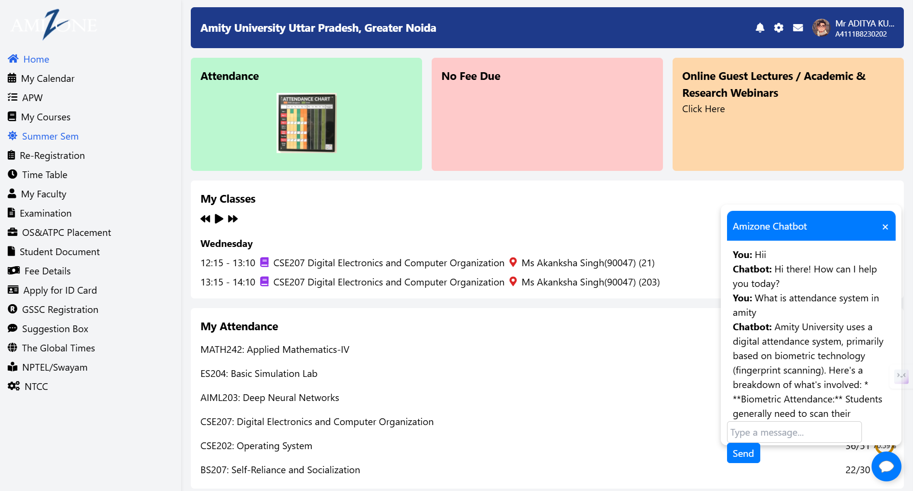

# 🚀 Amizone AI Chatbot  

### **Your Smart Guide to Amity University – Fast, Efficient, and AI-Powered!**  

 

---

## 📌 **Overview**
The **Amizone AI Chatbot** is an intelligent assistant designed to **help Amity University students** by answering queries about **attendance, timetables, exams, fees, and more**. It integrates:  
✅ **Gemini AI** for general queries  
✅ **Amity Handbook PDF Extraction** for accurate, official answers  
✅ **Web UI for Seamless Interaction**  

---

## 🎯 **Features**
✔️ **Instant Responses** – Ask about attendance, timetables, or any Amity policy.  
✔️ **Trained on Amity Handbook** – Retrieves official information directly from the handbook PDF.  
✔️ **AI-Powered Conversations** – Uses Google’s **Gemini API** to answer general queries.  
✔️ **User-Friendly UI** – Chatbot interface integrated into the **Amizone dashboard**.  
✔️ **Fast & Lightweight** – Flask backend with minimal processing overhead.  

---

## 🛠 **Tech Stack**
| Component | Technology Used |
|-----------|----------------|
| **Frontend** | HTML, CSS, JavaScript |
| **Backend** | Flask (Python) |
| **AI Model** | Google Gemini API |
| **Data Extraction** | PyMuPDF (for PDF text extraction) |
| **Storage** | JSON (for handbook knowledge) |
| **Hosting** | Localhost (Can be deployed on Heroku/Vercel) |

---

## 🚀 **Installation & Setup**
### 🔹 **Step 1: Clone the Repository**
```sh
git clone https://github.com/goblinasaddy/HackAThon.git
cd Amizone-Chatbot


### 🔹 **Step 2: Install Dependencies**

pip install flask flask-cors requests pymupdf


### 🔹 **Step 3: Extract Amity Handbook Data**

python extract_pdf.py

(This extracts text from amity_handbook.pdf and saves it in amity_handbook.json.)


### 🔹 **Step 4: Run the Flask Server**

python server.py

The server will start on: http://127.0.0.1:5000/


### 🔹 **Step 5: Open the Web Chatbot**

Open dash.html in your browser
Ask questions related to Amizone or Amity University

